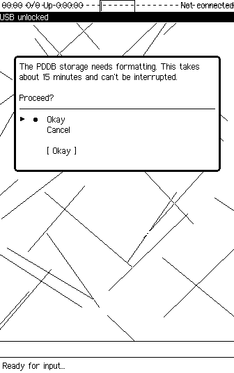
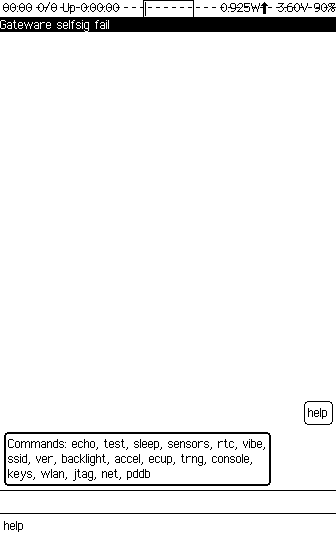

# Renode simulation for Xous on Precursor

Copyright (c) 2022 [Antmicro](https://www.antmicro.com/)

This repository contains a script and test suite to simulate the [Precursor](https://betrusted.io/) platform running [Xous](https://github.com/betrusted-io/xous-core) in [Renode](https://renode.io).

## Building

To test it locally, build [the latest Renode version](https://github.com/renode/renode/tree/master) from GitHub repository. For build instructions, please refer to [documentation](https://renode.readthedocs.io/en/latest/advanced/building_from_sources.html).

You can also use one of the pre-built [nightly packages](https://builds.renode.io).

To build Xous, run:

```
./build-xous.sh
```

All emulation files (e.g. ``xous.resc``, ``xous.repl``) will be stored in the ``xous-core/emulation`` folder.

## Usage

To start the emulation, run the following in Renode:

```
(monitor) s xous-core/emulation/xous.resc
```

or from terminal:

```
renode xous-core/emulation/xous.resc
```

## Running the simulation

You should see an emulated lcd screen like this:



You can use your keyboard to interact with the emulated LCD screen.

Run ``help`` to see the list of all available commands:



On UART you should see information about starting the main loop:

```
// SoC:sysbus.console
INFO:status: |status: starting main loop (services/status/src/main.rs:313)
```

